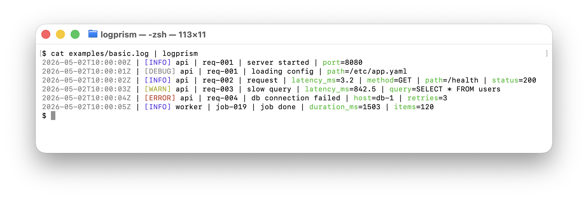
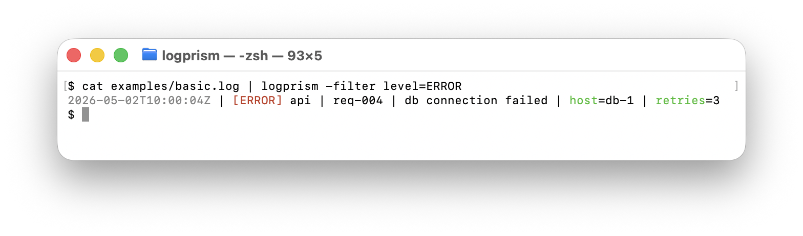

# logprism

A high-performance, zero-reflection CLI utility written in Go for transforming
structured JSON logs into human-readable, color-coded terminal output.

<p align="center">
  
</p>

<p align="center">
  
  
</p>

`logprism` reads JSON log lines from **stdin**, parses well-known fields
(`time`, `level`, `service`, `msg` / `message`, `trace_id`), and emits a single
colorized line per record on **stdout**. Lines that don't parse as JSON are
passed through unchanged.

## Install

```sh
go install github.com/Kishan-Thanki/logprism/cmd/logprism@latest
```

This installs the `logprism` binary into `$GOBIN` (or `$GOPATH/bin`). Make sure
that directory is on your `$PATH`.

## Usage

Pipe any JSON log stream into `logprism`:

```sh
my-service        | logprism
tail -f app.log   | logprism
docker logs -f x  | logprism
```

Or use file flags directly:

```sh
logprism -input app.log
logprism -input app.log -output readable.log
```

### Flags

| Flag                | Description                                                              |
|---------------------|--------------------------------------------------------------------------|
| `-input <path>`     | Read from file instead of stdin (`-` means stdin).                       |
| `-output <path>`    | Write to file instead of stdout (`-` means stdout). Disables color.      |
| `-filter key=value` | Only emit records where `key` equals `value`. Repeatable (AND-ed).       |
| `-pretty`           | Indent nested JSON values across multiple lines.                         |
| `-no-color`         | Disable ANSI color output (auto-disabled when piped or writing a file).  |
| `-version`          | Print the version and exit.                                              |

### Filtering

```sh
tail -f app.log | logprism -filter level=ERROR
tail -f app.log | logprism -filter level=INFO -filter service=api
```

`-filter` matches strings, numbers (`-filter status=200`), bools, and `null`.
Multiple `-filter` flags AND together. Records that don't parse as JSON are
dropped when any filter is active.

### Output format

```
<time> | [LEVEL] <service> | <trace_id> | <msg> | k1=v1 | k2=v2 | ...
```

- Extra fields (anything not in the well-known set) are appended in
  **alphabetical order** for stable, diff-friendly output.
- Missing `trace_id` is rendered as the all-zero UUID.
- Level is colored: `ERROR`/`FATAL`/`PANIC` red, `WARN` yellow, `INFO` blue,
  `DEBUG` gray.

### Example

Input:

```json
{"time":"2026-05-02T10:00:00Z","level":"INFO","service":"api","msg":"request","trace_id":"abc-123","status":200,"path":"/health"}
```

Output (color stripped):

```
2026-05-02T10:00:00Z | [INFO] api | abc-123 | request | path=/health | status=200
```

## Examples

Sample log files and ready-to-run commands live in [`examples/`](examples/).

## License

See [LICENSE](LICENSE).
